# 🍕 Zomato Clone — Full-Stack Restaurant Discovery App

A production-style **Zomato clone** — a full-stack restaurant discovery & food delivery platform.
React + Vite + Tailwind CSS + shadcn/ui on the frontend, Express + TypeScript on the backend.

> Built with `npx shadcn@latest`, pnpm workspaces, and fully documented with Mermaid flowcharts + real UI screenshots.

---

## 📋 Table of Contents

- [✨ Features](#-features)
- [🏗️ Architecture](#️-architecture)
- [🗄️ Tech Stack](#️-tech-stack)
- [🔀 Flowcharts](#-flowcharts)
  - [Data Flow](#data-flow)
  - [User Journey](#user-journey)
  - [API Request Lifecycle](#api-request-lifecycle)
  - [Repository Structure](#repository-structure)
- [🖼️ Frontend Screenshots](#️-frontend-screenshots)
- [🔌 API Reference](#-api-reference)
- [🚀 Getting Started](#-getting-started)
- [🌿 Git Workflow & Setup](#-git-workflow--setup)
- [🧪 Testing & Verification](#-testing--verification)
- [📁 Project Structure](#-project-structure)
- [🛡️ Environment & Ports](#️-environment--ports)

---

## ✨ Features

| Area | Details |
|------|---------|
| **Search** | Real-time restaurant/cuisine/dish search with debounced filtering |
| **Categories** | 10 cuisine categories (Pizza, Burger, Chinese, South Indian, North Indian, Desserts, Biryani, Rolls, Cafe, Seafood) |
| **Collections** | Curated lists (Trending This Week, Newly Opened, Legendary Places, Great Cafes) |
| **Restaurant Cards** | Rating badge, delivery time, price-for-two, offers, veg/non-veg tags |
| **Sorting** | By relevance, rating, delivery time, or price (low to high) |
| **Responsive** | Mobile-first with hamburger sheet menu, adaptive grids |
| **Auth UI** | Log in / Sign up flows (UI state, ready for real auth) |
| **Loading/Error** | Skeletons while fetching, friendly retry on API failure |

---

## 🏗️ Architecture

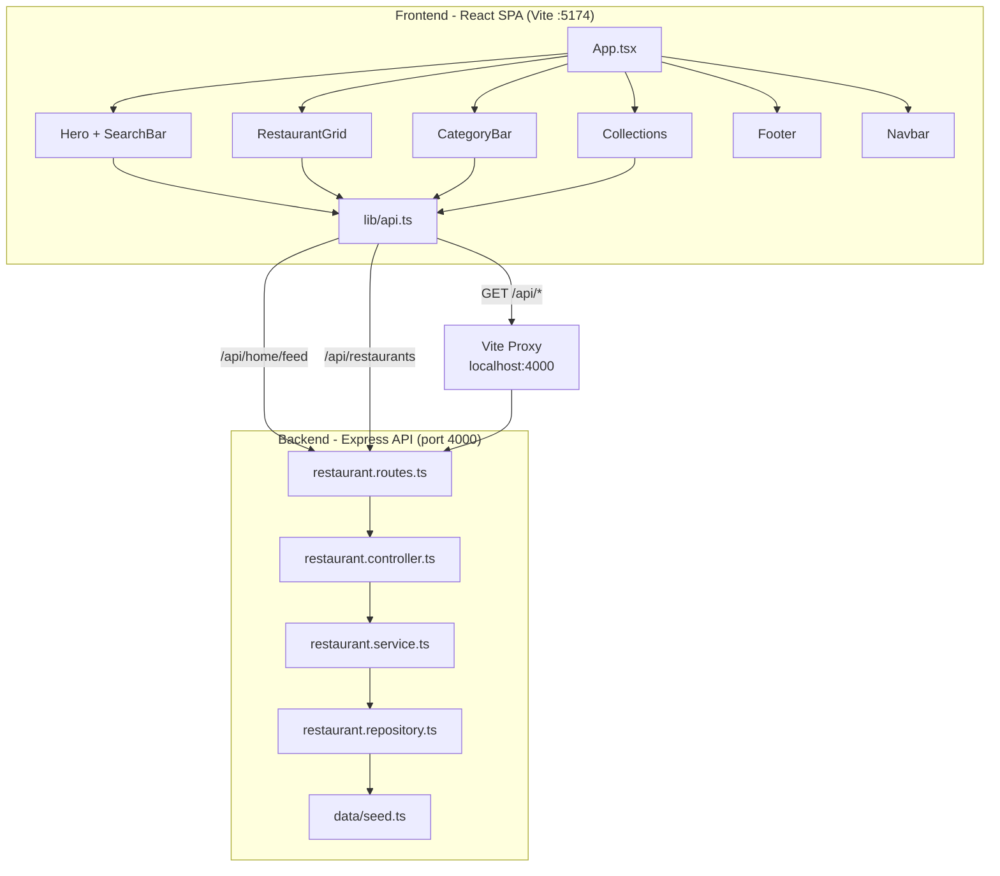

**Key points**

- The frontend never talks to the backend directly — Vite's dev proxy forwards `/api` to `http://localhost:4000`.
- The backend is a clean **route → controller → service → repository → seed data** layering.
- Swapping the in-memory repository for a real DB later only touches `restaurant.repository.ts`.

---

## 🗄️ Tech Stack

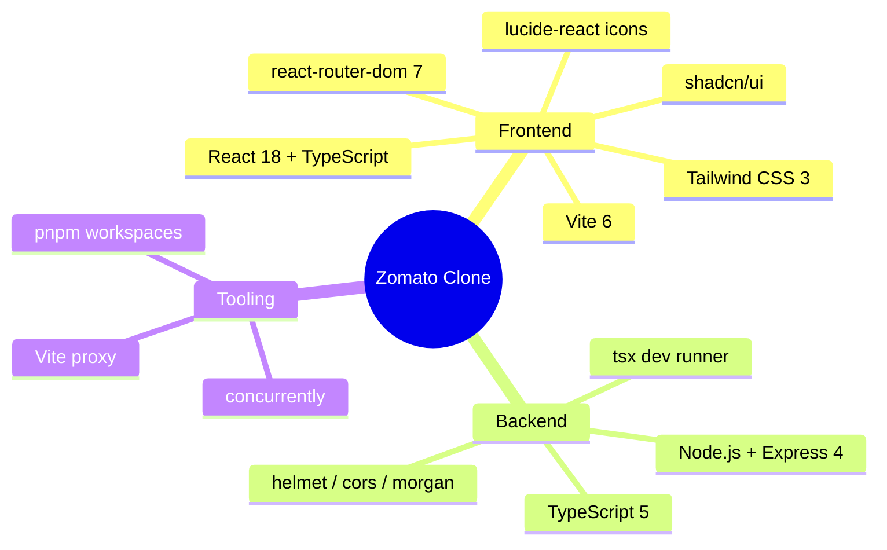

---

## 🔀 Flowcharts

### Data Flow

How data moves from seed to API to UI:

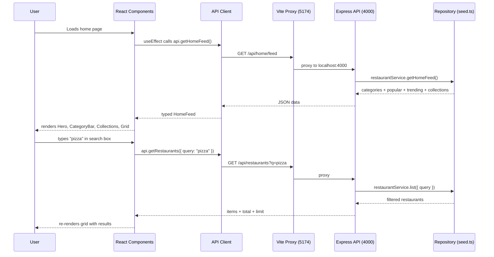

### User Journey

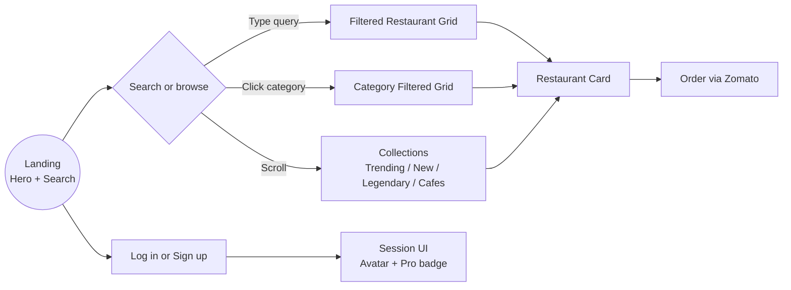

> Note: Restaurant detail page + cart flow are the next milestone — the card already receives the full `Restaurant` object.

### API Request Lifecycle

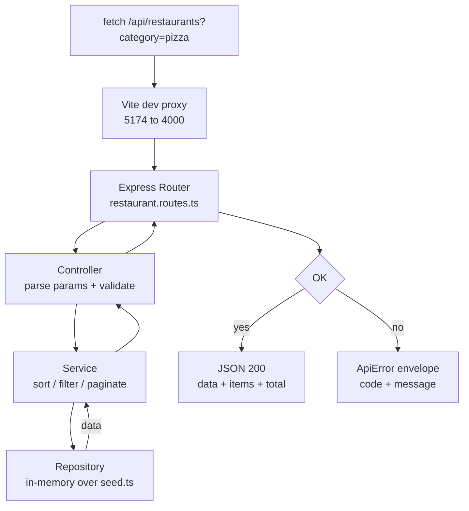

### Repository Structure

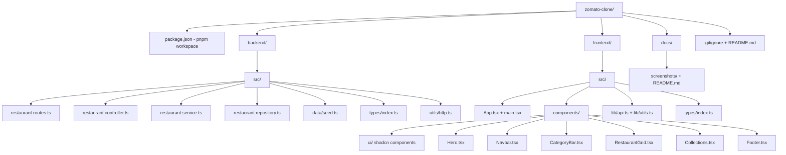

---

## 🖼️ Frontend Screenshots

> Captured live from the running dev server with **Playwright** (headless Chromium, 1440×900).

**1. Hero + Search** — cinematic hero with location picker & live search:

<div align="center">
  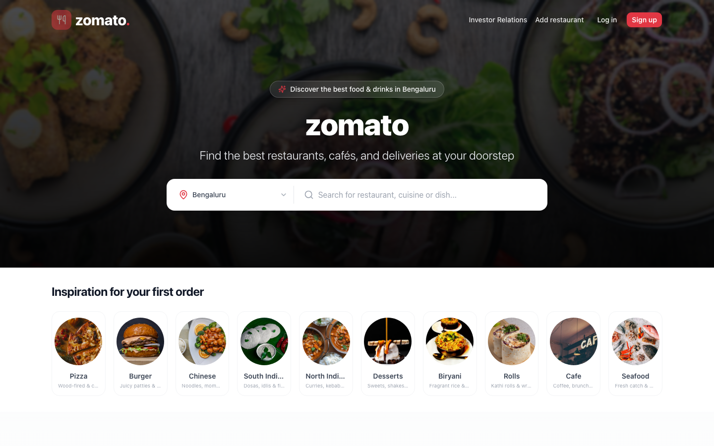
</div>

**2. Category Bar** — 10 cuisine categories with hover effects:

<div align="center">
  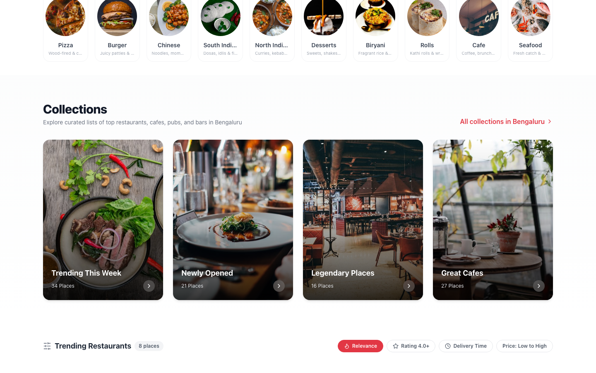
</div>

**3. Restaurant Grid** — rating, delivery time, offers, price-for-two cards:

<div align="center">
  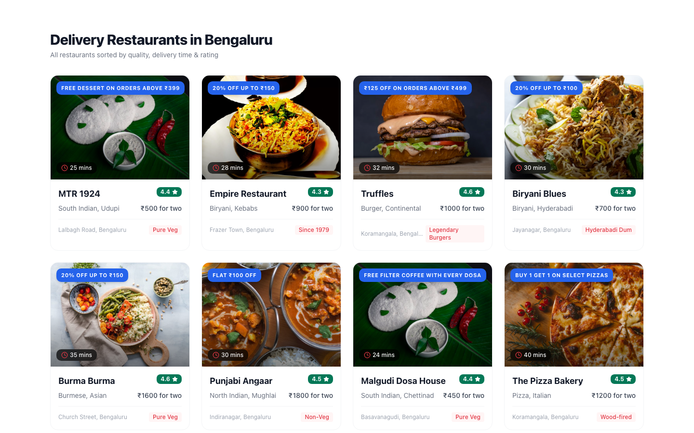
</div>

**4. Collections** — curated list tiles:

<div align="center">
  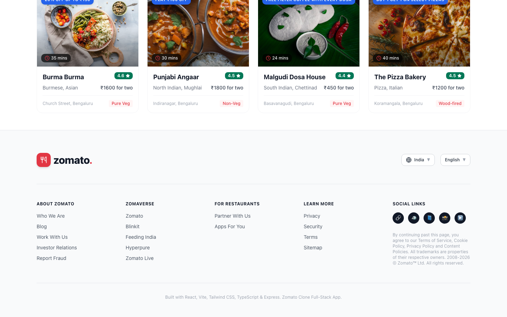
</div>

**5. Footer** — full multi-column footer with links & social:

<div align="center">
  
</div>

**6. Mobile view (390px)** — responsive hamburger nav:

<div align="center">
  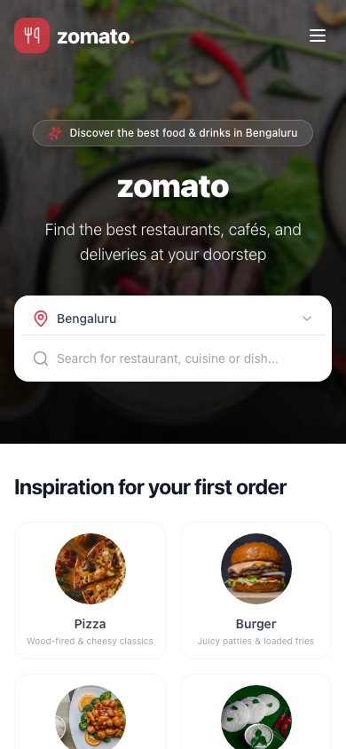
</div>

**7. Live Search "pizza"** — real-time filtering:

<div align="center">
  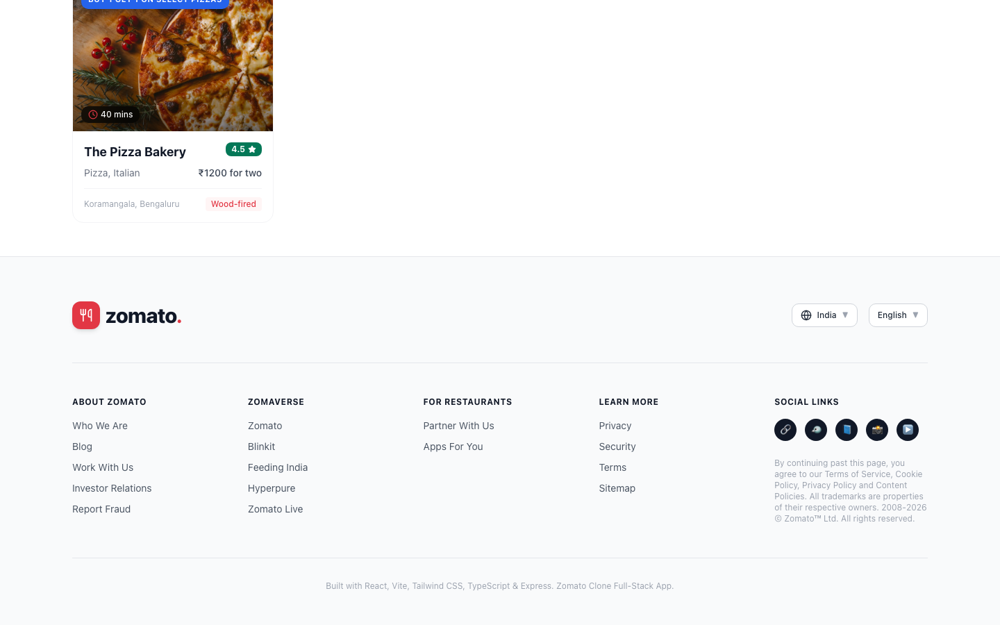
</div>

**8. Category Filter "Pizza"** — clicking the category chip filters results:

<div align="center">
  
</div>

---

## 🔌 API Reference

Base URL: `http://localhost:4000/api` (dev) — proxied through `http://localhost:5174/api` in dev.

| Method | Endpoint | Description | Query Params |
|--------|----------|-------------|--------------|
| GET | `/api/home/feed` | Everything the home page needs in one call | — |
| GET | `/api/restaurants` | List restaurants | `category`, `q`, `sort` (`rating`/`price`/`delivery`/`relevance`), `limit` (1-50) |
| GET | `/api/restaurants/:id` | Single restaurant detail | — |
| GET | `/api/categories` | All cuisine categories | — |
| GET | `/api/collections` | All curated collections | — |
| GET | `/health` | Health check `{ status, uptime, timestamp }` | — |

**Error envelope:** `{ "error": { "code": "NOT_FOUND", "message": "Restaurant "r99" not found" } }`

**Sample success:**

```jsonc
// GET /api/home/feed
{
  "data": {
    "categories": [ { "id": "pizza", "name": "Pizza", "image": "...", "description": "..." } ],
    "popular": [ /* 8 restaurants sorted by ratingCount */ ],
    "trending": [ /* 8 restaurants sorted by rating */ ],
    "collections": [ { "id": "c1", "title": "Trending This Week", "count": 34 } ]
  }
}
```

---

## 🚀 Getting Started

### Prerequisites

- **Node.js** ≥ 18 (developed on v24)
- **pnpm** ≥ 9 (`corepack enable` or `npm i -g pnpm`)

### 1. Install dependencies

```bash
pnpm install:all        # installs backend/ + frontend/
```

### 2. Run both servers (dev)

```bash
pnpm dev                # concurrently: backend :4000 + frontend :5173
```

> ⚠️ **Important:** if your shell exports `PORT=8642` (e.g. a gateway), the backend will try to bind 8642!
> Start it explicitly instead:
>
> ```bash
> PORT=4000 pnpm --dir backend dev
> pnpm --dir frontend dev
> ```

- Frontend (Vite): **http://localhost:5173** — may auto-increment to `5174` if 5173 is busy
- Backend API: **http://localhost:4000**
- Health check: **http://localhost:4000/health**

### 3. Build for production

```bash
pnpm build              # tsc + vite build (frontend) ; tsc (backend)
pnpm --dir frontend preview   # serve the built dist/
```

---

## 🌿 Git Workflow & Setup

This repository uses **GitHub Flow** — a short-lived `main` branch with feature branches + PRs.

### Branching model

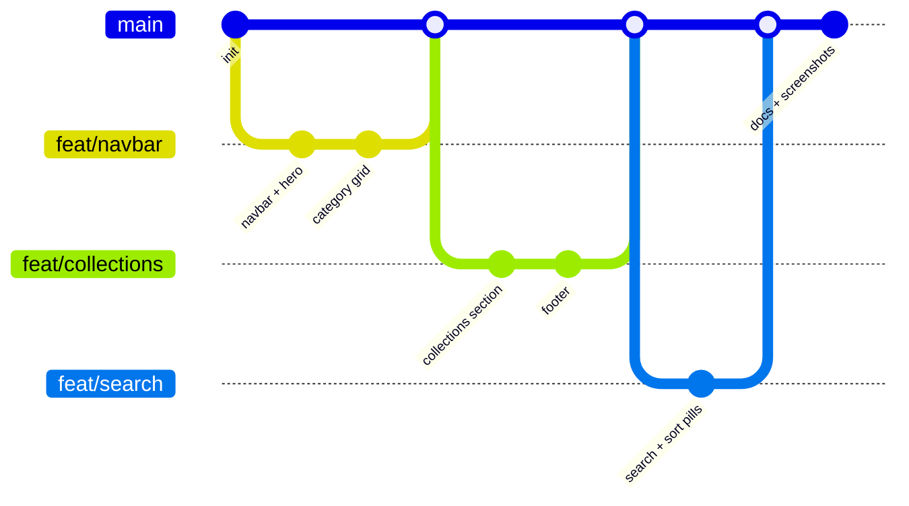

### Recommended commands

```bash
# Clone
git clone <your-remote-url> && cd zomato-clone

# Create a feature branch
git checkout -b feat/restaurant-detail

# ... work ...

# Check what changed (never blindly commit)
git status --short
git diff --stat

# Stage only what you intend
git add frontend/src/components/RestaurantGrid.tsx

# Commit with a concise, conventional message
git commit -m "feat(restaurant): add restaurant detail view"

# Push and open a PR
git push -u origin feat/restaurant-detail
# → open PR on GitHub → merge to main
```

### Commit conventions

| Prefix | Use for |
|--------|---------|
| `feat:` | New feature (search, cart, auth) |
| `fix:` | Bug fix |
| `docs:` | Docs, README, flowcharts |
| `refactor:` | Code changes that don't change behavior |
| `chore:` | Tooling, deps, config |
| `style:` | Formatting, CSS |

### .gitignore essentials

```gitignore
node_modules/
dist/
dist-ssr/
*.local
.env
.env.*
!.env.example
*.log
.DS_Store
.smoke/
coverage/
```

> Secrets (`*.env`), build output (`dist/`), node modules, and local tooling are all ignored — never commit tokens or build artifacts.

### Rules of thumb

1. **`git status --short` before any significant change** — know your tree.
2. **Never commit secrets/.env** — use `.env.example` as the template.
3. **Stage only intended files** — inspect `git diff` (staged) before committing.
4. **Preserve other people's work** — don't `git reset --hard` / `clean -fd` without explicit approval.
5. **Feature branches → PR → main** — never push straight to main for anything bigger than a typo fix.

---

## 🧪 Testing & Verification

| Check | Command | Status |
|-------|---------|--------|
| Backend typecheck | `pnpm --dir backend typecheck` | ✅ Passing |
| Frontend typecheck | `pnpm --dir frontend typecheck` | ✅ Passing |
| Frontend production build | `pnpm --dir frontend build` | ✅ Passing (934ms) |
| Runtime | both servers up, proxy verified | ✅ Passing |
| UI | Playwright screenshots of all sections | ✅ Captured |

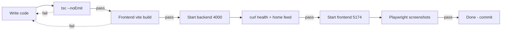

---

## 📁 Project Structure

```
zomato-clone/
├── package.json              # pnpm workspace root scripts
├── .gitignore
├── README.md                 # ← you are here
├── backend/                  # Express + TypeScript API
│   └── src/
│       ├── index.ts          # server boot + graceful shutdown
│       ├── app.ts            # express app (helmet/cors/morgan)
│       ├── routes/restaurant.routes.ts
│       ├── controllers/restaurant.controller.ts
│       ├── services/restaurant.service.ts
│       ├── repositories/restaurant.repository.ts
│       ├── data/seed.ts      # 14 restaurants, 10 categories, 4 collections
│       ├── types/index.ts
│       └── utils/http.ts     # ApiError + error envelope
└── frontend/                 # React + Vite SPA
    ├── index.html
    ├── vite.config.ts        # proxy /api → :4000
    ├── tailwind.config.js
    ├── components.json       # shadcn config
    └── src/
        ├── main.tsx
        ├── App.tsx
        ├── index.css
        ├── types/index.ts
        ├── lib/api.ts        # typed fetch client
        └── components/
            ├── Hero.tsx
            ├── Navbar.tsx
            ├── CategoryBar.tsx
            ├── RestaurantGrid.tsx
            ├── Collections.tsx
            ├── Footer.tsx
            └── ui/           # shadcn button, card, badge, sheet, etc.
```

---

## 🛡️ Environment & Ports

| Service | Default Port | Notes |
|---------|--------------|-------|
| Backend (Express) | **4000** | Bind explicitly with `PORT=4000` |
| Frontend (Vite dev) | **5173** (→ 5174 if busy) | — |
| Vite proxy target | `http://localhost:4000` | `/api/*`, `/health` |

> ⚠️ A shell-global `PORT=8642` (reserved by a gateway/local infra) will override the backend's default — always launch the backend as `PORT=4000 pnpm --dir backend dev`.

---

## 🧭 Next Milestones (Roadmap)

- [ ] Restaurant **detail page** (`/restaurant/:id`) with menus & reviews
- [ ] **Cart** with quantity steppers + order summary
- [ ] **Checkout** (Stripe / Razorpay sandbox)
- [ ] **Real auth** (Supabase or JWT) with user profiles & orders history
- [ ] Supabase Postgres instead of in-memory seed (only `repository.ts` changes)
- [ ] CI via GitHub Actions on push (typecheck → build → deploy)

---

<p align="center">
  Made with 🧡 · React · Express · TypeScript · Tailwind · shadcn/ui
</p>